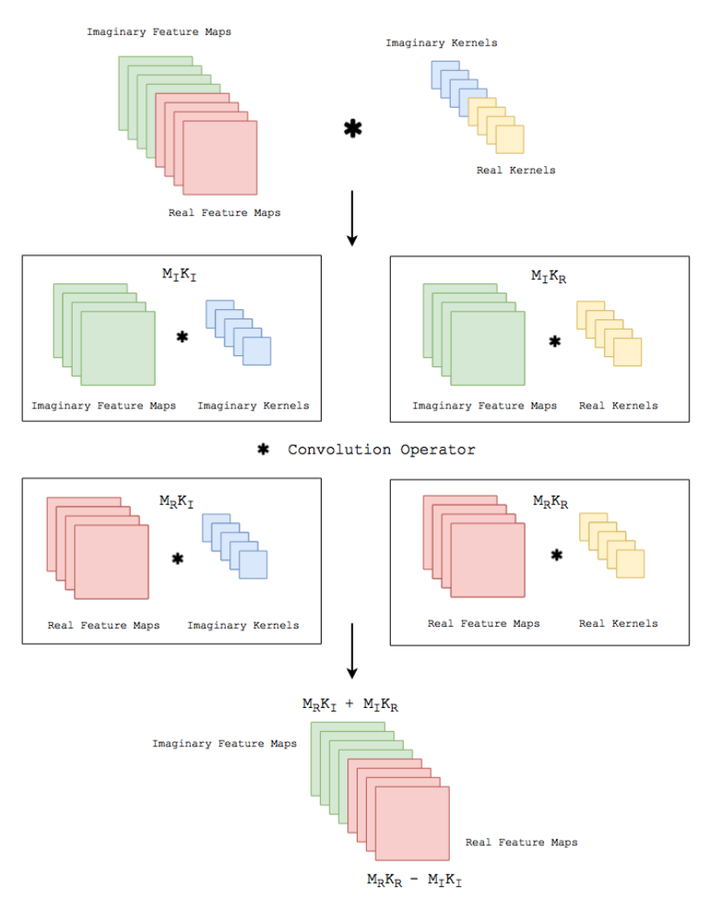

Implementation and Math
=========================
Complex convolutional networks provide the benefit of explicitly modelling the phase space of physical systems :cite:`trabelsi2017deep`. 
The complex convolution introduced can be explicitly implemented as convolutions of the real and complex components of both kernels and the data.
A complex-valued data matrix in cartesian notation is defined as :math:`\textbf{M} = M_\Re + i M_\Im` and equally, the complex-valued convolutional kernel is defined as :math:`\textbf{K} = K_\Re + i K_\Im`.
The individual coefficients :math:`(M_\Re, M_\Im, K_\Re, K_\Im)` are real-valued matrices, considering vectors are special cases of matrices with one of two dimensions being one.

Complex Convolution Math
---------------------------
The math for complex convolutional networks is similar to real-valued convolutions, with real-valued convolutions being:

.. math::
    \int f(y)\cdot g(x-y) \, dy

which generalizes to complex-valued function on :math:`\mathbf{R}^d`:

.. math::
    (f * g )(x) = \int_{\mathbf{R}^d} f(y)g(x-y)\,dy = \int_{\mathbf{R}^d} f(x-y)g(y)\,dy,

in order for the integral to exist, f and g need to decay sufficiently rapidly at infinity [`CC-BY-SA Wiki <https://en.wikipedia.org/wiki/Convolution#Domain_of_definition>`_].

Implementation
-----------------
Solving the convolution of, implemented by :cite:`trabelsi2017deep`, translated to keras in :cite:`dramsch2019complexsoftware`

    Complex Convolution implementation (CC-BY :cite:`trabelsi2017deep`)

.. math::
    M' = K * M = (M_\Re + i M_\Im) * (K_\Re + i K_\Im),

we can apply the distributivity of convolutions to obtain

.. math::
    M' =  \{M_\Re * K_\Re - M_\Im * K_\Im\} + i \{ M_\Re * K_\Im + M_\Im * K_\Re\},

where K is the Kernel and M is a data vector.

Considerations
-----------------
Complex convolutional neural networks learn by back-propagation. 
:cite:`Sarroff2015` state that the activation functions, as well as the loss function must be complex differentiable (holomorphic).
:cite:`trabelsi2017deep` suggest that employing complex losses and activation functions is valid for speed, however, refers that :cite:`Hirose2012` show that complex-valued networks can be optimized individually with real-valued loss functions and contain piecewise real-valued activations.
We reimplement the code :cite:`trabelsi2017deep` provides in keras with tensorflow , which provides convenience functions implementing a multitude of real-valued loss functions and activations.

[CC-BY :cite:`dramsch2019complex`]

.. bibliography:: bib.bib
   :cited: